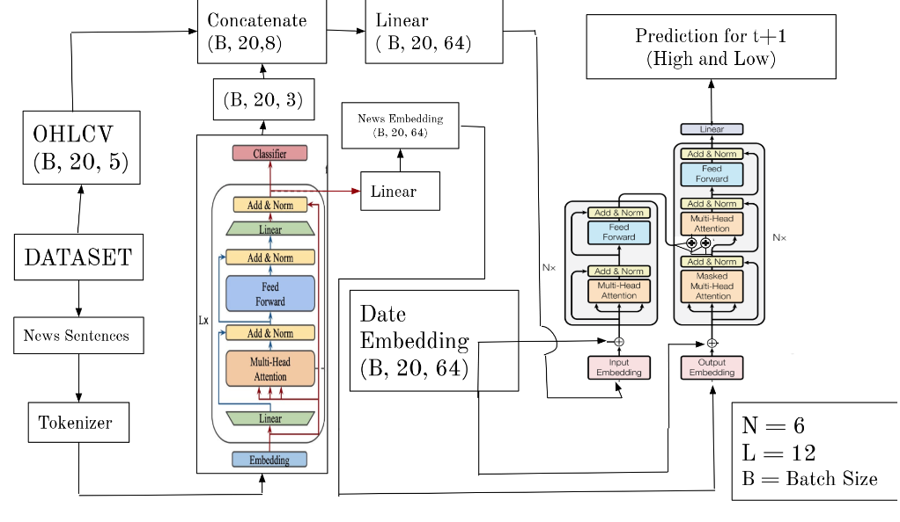

# Stock Market Forecasting using Transformers
Very Pleased to update this Repository on the First Phase of our project, which focuses on forecasting future prices of stock.

## Methadology


[Detailed Report of Present Work](https://drive.google.com/file/d/13BXuDneqpjd_us7REzVd3sojpb0wwTRp/view?usp=drive_link)
### Clone the Repository
```
git clone git@github.com:BhavikShangari/DS250_Project.git
```
### Install the Required Dependencies
```
pip install -r requirements.txt
```
### Train the model
```
python3 run.py
```
